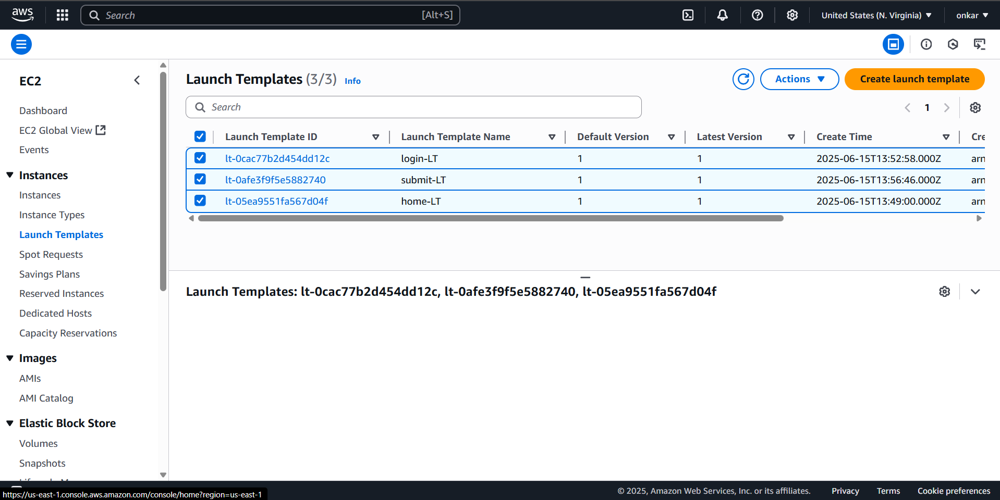
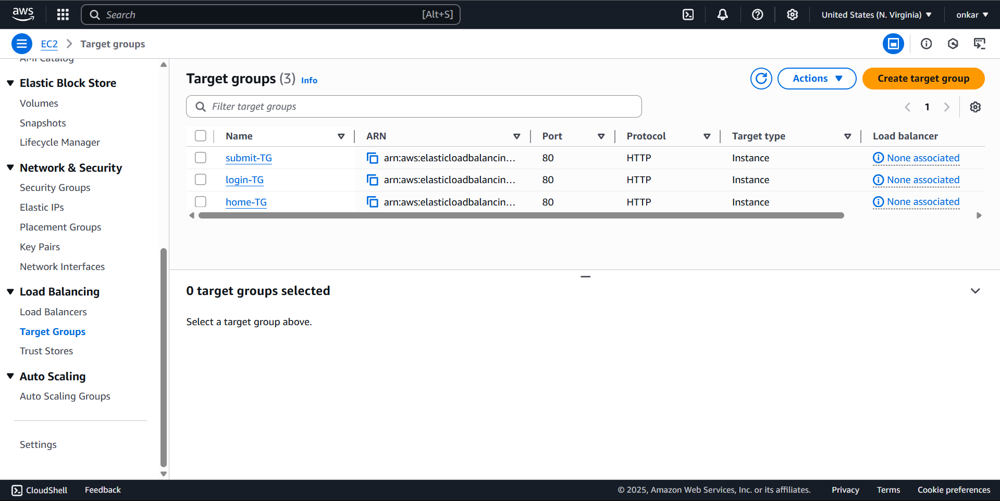
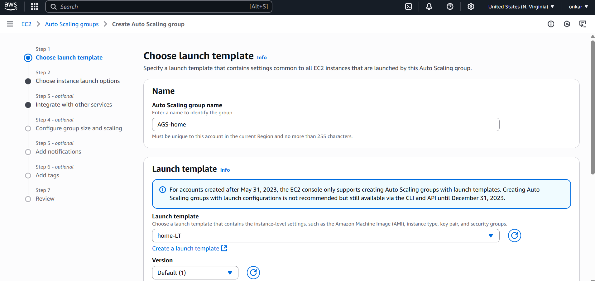
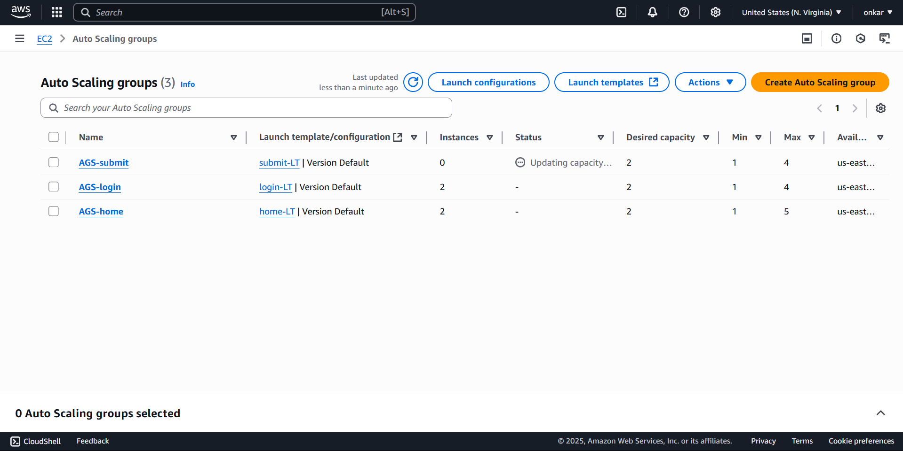

# Webapp Deployment with ***Auto Scaling Group*** and ***Load Balancer***
### In this project we describe how we deploy a web application using Three ( AGS )auto scaling group - each consist with HTML files (`home.html`, `login.html`, and `submit.html`) Each ASG is linked to a dedicated **Target Group**, all managed under a single **Application Load Balancer (ALB)** to make application highly available with no down time when traffic increase.
---
- *An AGS ( ***Auto Scaling Group*** ) is  a service that automaticaly increase server when traffic is increased and decrease server when traffic decrease , just we have to configure some configuration.*
- *A LB ( ***Load balancer*** ) is service that automatically distributes your incoming traffic across multiple targets, such as EC2 instances, containers, and IP addresses, in one or more Availability Zones.* 
---
## Diagram Representation :


## 🛠️Steps to Deploy 
### 1) 💻Login in to the AWS 
### 2) 🔒Create Security Group:
- In a 🔍search bar search *EC2* 
- In *EC2* console their is a ***Network & Security*** in the Left side , under that their is `Security group`
- Go to that and click on *Create security group* to create new security group
- Give name to SG - **AGS-LB**
- In inbound rule section , click Add Rule and add type - `SSH , HTTP , HTTPS` and select source `Select Anywhere IPv4`

### 3) Create a Launch Template:
- In that *EC2* service , in the left menu under the *instance* click on `Launch Template`
- In that *Launch Template* click on ***_Create launch template*** ,
we have to create ***three*** Templates.
#### - For first template :
 ```> Launch template name : home-LT 
 > Template version description : this is my home page
 > AMI : Amazon Linux 2023 #free tier
 > Instance type : t2.micro
 > Key pair : #select key-pair as you created
 > Network settings : # in network setting ( select security group ) as we created ---> " AGS-LB "
 ```
- Scroll down and click on **Advanced Details** 
- In advanced details go last option `user data` in that field enter your script as ***We creating Launch template for Home page so write script for home-LT*** , as below
```bash
#!/bin/bash
yum update -y
yum install stress -y
yum install -y nginx
cat <<EOF > /usr/share/nginx/html/index.html
<!DOCTYPE html>
<html>
<head>
    <title>Home</title>
</head>
    <body><h1>Welcome to the Home Page</h1><a href="/login">Login</a></body>
</html>
EOF
systemctl enable nginx
systemctl start nginx
```
#### - For second template :
```> Launch template name : login-LT 
 > Template version description : this is my login page
 > AMI : Amazon Linux 2023 #free tier
 > Instance type : t2.micro
 > Key pair : #select key-pair as you created
 > Network settings : # in network setting ( select security group ) as we created ---> " AGS-LB "
 ```
- Scroll down and click on **Advanced Details** 
- In advanced details go last option `user data` in that field enter your script as ***We creating Launch template for Login page so write script for login-LT*** , as below
```bash
#!/bin/bash
yum update -y
yum install stress -y
yum install -y nginx
cat <<EOF > /usr/share/nginx/html/login.html
<!DOCTYPE html>
<html>
<head><title>Login</title></head>
<body>
  <h1>Login Page</h1>
  <form action="/submit" method="post">
    Username: <input type="text" name="username" required><br>
    Password: <input type="password" name="password" required><br>
    <input type="submit" value="Submit">
  </form>
</body>
</html>
EOF
systemctl enable nginx
systemctl start nginx
```
#### - For Third Template :
``` > Launch template name : submit-LT 
 > Template version description : this is my submit page
 > AMI : Amazon Linux 2023 #free tier
 > Instance type : t2.micro
 > Key pair : #select key-pair as you created
 > Network settings : # in network setting ( select security group ) as we created ---> " AGS-LB "
 ```
- Scroll down and click on **Advanced Details** 
- In advanced details go last option `user data` in that field enter your script as ***We creating Launch template for submit page so write script for submit-LT*** , as below
```bash
#!/bin/bash
yum update -y
yum install -y nginx
cat <<EOF > /usr/share/nginx/html/submit.html
<!DOCTYPE html>
<html>
<head><title>Submit</title></head>
<body>
  <h1>Form Submitted Successfully!</h1>
  <p>Thank you for logging in.</p>
  <a href="/home">Go back to Home</a>
</body>
</html>
EOF
systemctl enable nginx
systemctl start nginx
```
- Now we created three template ,


### 4) Create Target Groups :
- In left side menu , their is ***Load balancing*** option , Under that ther is ***Target Groups***
- Click on *Target Groups* and go to **Create target groups** in that , we have to create TG for home page.
> Choose a Target type : instance <br>
> Target group name : home-TG<br>
> Protocol : HTTP | Port : 80 <br>
> IP type : IPv4 <br>
> Health checks : Dont change <br>
- Click on Next, do not register any target just click ***Create Target Group***.
#### As using above step create another TG for ***( login page and Submit page )***
* For login page TG -
> Choose a Target type : instance <br>
> Target group name : login-TG<br>
> Protocol : HTTP | Port : 80 <br>
> IP type : IPv4 <br>
> Health checks : health check path : /login.html<br>
- Click on Next, do not register any target just click ***Create Target Group***.
* For submit page TG -
> Choose a Target type : instance <br>
> Target group name : submit-TG<br>
> Protocol : HTTP | Port : 80 <br>
> IP type : IPv4 <br>
> Health checks : Health check path : /submit.html<br>
- Click on Next, do not register any target just click ***Create Target Group***.

### 5) Create Load balancer :
- In that Load Balancing  their is `load balancers` click on that to create load balancer
- next step create an Application Load Balancer, click on *create* under Application Load Balancer.
- Now next make some configuration
```
> Load Balancer Name : webapp-LB
> Scheme : internet-facing
> Load balancer IP type : IPv4
> VPC : Default
> Availability Zones and Subnets : Select ANY Three
> Security groups : AGS-LB ---> as we created 
```
- In listener and routing do not change any Just Click on ***Default Action*** , in that select target group we created ***only select home-TG because it is in index.html file . 
> Default action : home-TG
- Do not click any change for remaining options , Just *click* `create load balancer` 
- Recheck your load balancer configuration and click on `Create load balancer` and then it created.


### 6) Create An Auto Scaling Group (ASG) :
- We already created *Three* launch template for *three* ASG , now we have to created three ASG 
- On left side under the *Load Balancing* option their is an ***auto scaling*** option , click on ***create auto scaling group***  to create ASG
- For creating AGS their are some steps that we have to do -

#### For first home-AGS :
> Auto Scaling Group name : AGS-home<br>
> Launch Template : # select  < home-LT > which we created<br>
- Click on `next`
> In network section select 3 availability zone<br> 
> In Availability zone distribution set < Balanced best effort ><br>
> In Load balancing Section select < attach to an exixting load balancer ><br>
> Choose Target group : home-TG<br>
> Health grace period : 180<br>
- Click on `next`
> In group size section:<br>
>       set desired capacity : 2
>       min : 1 
>       max : 4
- In scaling policies
> Select Target tracking scaling policy<br>
> Metric type : select average CPU utilization<br>
> Target value : 60<br>
> Instance warmup : 10<br>
> Disable scale in to create only a scale-out policy : unchecked<br>
- On another option kept as default 
- click on `next`
- To Add notifications , click on `next`
- To Add Tags , click on `next` 
- Next Review whole page and click on `create auto scaling group`.
- now we created first ASG as ( AGS-home)
- after that Go to *EC2* instances and name the created instance as a *home*
#### As like above step we have create second ASG - login-AGS :
- as above steps just change some configuration as given and **other are as given above from first ASG**
> auto scaling group name : AGS-login<br>
> Launch Template : # select  < login-LT > which we created<br>
> choose Target group : login-TG<br>
- now we created first ASG as (login-AGS)
- after that Go to *EC2* instances and name the created instance as a *login*
#### AS like first ASG step we have create third ASG - submit-AGS :
- as from first ASG step we just change some configuration as given and **other are as given from first ASG**
> Auto scaling group name : AGS-submit<br>
> Launch Template : # select  < submit-LT > which we created<br>
> Choose Target group : submit-TG<br>
- now we created first ASG as ( AGS-submit)
- after that Go to *EC2* instances and name the created instance as a *submit*


- Instances created by ASG :

### 7) Register Target
- Go target group 
- select the home-TG and in that click on  `Register Target`
- In that , their is instances that created by ASG 
- Select two ***home*** name instances and Click on *Include as pending below*
- Scroll down and click on `register pending targets`
Above step for only home-TG , but we have created another two , for those we have to repeate this step
#### For login-TG :
- select the login-TG and in that click on  `Register Target`
- In that , their is instances that created by ASG 
- Select two ***login*** name instances and Click on *Include as pending below*
- Scroll down and click on `register pending targets`
#### For submit-TG :
- select the submit-TG and in that click on  `Register Target`
- In that , their is instances that created by ASG 
- Select two ***submit*** name instances and Click on *Include as pending below*
- Scroll down and click on `register pending targets`
### 8) To Add listener rule in WEBAPP-LB
- Go to load balancer 
- Click on `webapp-LB`

#### for first rule
- click on `Listeners and rules` in that select `HTTP:80` 
- after clicking `HTTP:80` click on **Add rule**
- In that select `login-TG` and select *path* and path pattern `/login.html`
- And give `[ 1 ]` priority to login-TG
- click on add rule
#### for second rule
- click on `Listeners and rules` in that select `HTTP:80` 
- after clicking `HTTP:80` click on **Add rule**
- In that select `submit-TG` and select *path* and path pattern `/submit.html`
- And give `[ 2 ]` priority to submit-TG
- click on add rule


### 9) 💡check whether the web server is working and  APP is deployed :
- Go to Load balancer and copy `DNS name`

- Copied DNS name paste on *Browser* and hit 


- and also check for login page and submit page , by adding login.html in the url by adding in **[ /login.html ]** url `webapp-lb-438126208.us-east-1.elb.amazonaws.com/login.html
`


- for submit page add **[ /submit.html ]** , url `webapp-lb-438126208.us-east-1.elb.amazonaws.com
/submit.html`


### 10) Testing  ASG :
- Go to instances 
- Select home instance and click on connect 
- Go to git bash terminal and connect 
- To check that stress is installed or not use this command
```bash
which stress
```
- To start test stress on machine that increase CPU utilization use this command -
```bash
stress --cpu 80 --io 4 --vm 2 --vm-bytes 128M --timeout 10m &
```
- Check whether the new instance added or not , after few minutes
- If added so your are done your project properly and your ASG is working with LB.

---
## 📄Summary
This project demonstrates the deployment of a simple yet scalable HTML web application on AWS using a robust architecture that combines multiple Auto Scaling Groups (ASGs) and an Application Load Balancer (ALB). The application consists of three distinct static HTML pages — home.html, signup.html, and login.html — each served by its own dedicated ASG. Each Auto Scaling Group is configured with a specific launch template that boots EC2 instances preconfigured to serve its assigned page using a basic HTTP web server. An Application Load Balancer is set up to intelligently distribute incoming user traffic based on URL path rules: requests to the root path (/) are routed to the Home ASG, while requests to /signup and /login are routed to their respective ASGs. This design demonstrates best practices in high availability and elasticity by allowing each page to scale independently in response to demand, ensuring fault tolerance by automatically replacing unhealthy instances, and efficiently distributing traffic to healthy targets. Security Groups are configured to allow only the necessary HTTP traffic from the public internet, ensuring a secure and controlled environment. This project showcases practical skills in setting up launch templates, configuring path-based routing with ALB listener rules, managing Auto Scaling Groups, and using cloud-native infrastructure to build a modular, resilient, and highly available web application. The final result is a fully functional HTML application accessible through a single Load Balancer DNS name, with each page dynamically routed to its appropriate back-end ASG, demonstrating a real-world approach to scalable cloud architecture.
